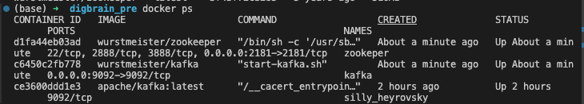
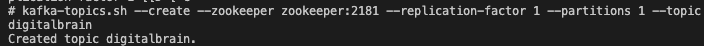

# Kafka Web Scraping

This project aims to scrape the product data on the first page of the website https://scrapeme.live/shop/ and write this data as a JSON message to a Kafka topic. It also provides an API to view this data

This project can be build by simply running this command:

`docker-compose up -d`

### TASK 1

* #### Show images:

    

* #### List the container details where all docker containers are running:

    

* #### Go into docker command line:

    

    

* #### Create a kafka topic using kafka cli command:

    

* #### Send message to kafka topic using kafka cli command:

    

* #### Listen messages produced on some topic using kafka cli command:

    

### TASK 2 AND TASK 3

This docker container have 4 images. `kafka-web-scraping-zookeeper-1` is needed for `kafka-web-scraping-kafka-1` image. This two image is the core for this project. Because in the end we'll send scraped data to Kafka topic. `kafka-web-scraping-scraper-1` image simply run `scraper.py` file. In this file we create KafkaAdminClient to create a topic called 'digitalbrain'. And after scraping data we send every product's json data to this 'digitalbrain' topic as message. With `flush()` next item is not going to topic before all current data is sended. And inside this image you can see the process. After sending messages to topic, we listen/see data in 'digitalbrain' topic and write data inside the app volume as `data.json`. So after all this process this image will be exited and the data.json file written in app volume will be used for `kafka-web-scraping-fastapi-1` image. Inside this image use the [link](http://0.0.0.0:8000) to see data in topic. I used Fastapi to write this api since it's fast and easy to begin with.

For web scraping part I used **BeautifulSoup** library. It's more efficent and faster way to fetch data. I only scraped first page and name, price, description, stock fields as specified in task explanation. To use Kafka with Python I used **kafka-python** library. I created client to create topic and send message to topic.

#### Some example logs from container kafka-web-scraping-scraper-1

* When you run the Docker, it will take some time to load the logs of the digital-scraper-1 image as it tries to find the Kafka Broker. After waiting for a while, you will see some messages in the logs: a message that the Topic was created, a done message for each object produced and sent, and finally you can see a list of the products in the correct format.()

#### Some example logs from container kafka-web-scraping-fastapi-1

#### The view of the API that contains data that scraped

